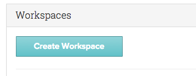
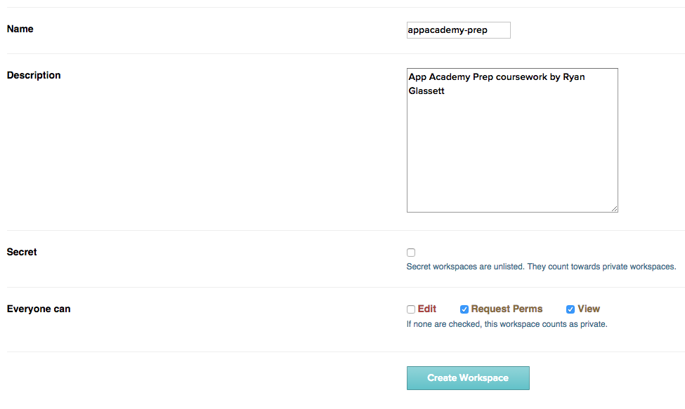
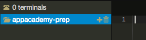
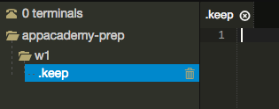
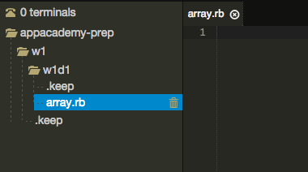

# Managing Your Floobits Workspace

Floobits is a great collaborative text editor, but when it comes to
managing your file and directory structure, it probably feels a bit
alien. Here's a quick guide to setting up your workspace.

### Create a workspace


This step is pretty easy: simply enter the name of your workspace.
Let's use **appacademy-prep** for clarity.

### Workspace setup


Let's add a basic description. You should allow everyone to **view**
your workspace (this way TAs can pop in and view your code anytime). You
should also allow anyone to **request permissions**; this way, you can
approve your partners and TAs to collaborate with you on your projects.

### Adding files and folders

Once you create the workspace, you should find yourself looking at a
README file automatically generated by Floobits. You can delete this by
clicking the trash icon next to its filename on the left-hand side of
the window.

You can create new files under any folder by clicking on the `+` next to
the folder's name in the sidebar:



Adding a directory is a bit tricky. Floobits doesn't like it when you
try to add a directory by itself. You need to trick it by adding a file
**nested under** the new directory. Check it out:


Once you've finished adding your new directory, your file structure
should look something like this:



It's much easier to add a file than a directory. Click the `+` button,
as before. This time, you should be able to simply enter the name of
your new file. Play around with this for a bit until you feel
comfortable. Your finished setup for W1D1 should look something like
this:



### Recommended file structure

We recommend organizing your projects first by week, then by day. This
has been the easiest to work with in our experience:

```
appacademy-prep/
 |- w1/
 |  |- w1d1/
 |  |  |- array.rb
 |  |
 |  |- w1d2/
 |
 |- w2/
```
